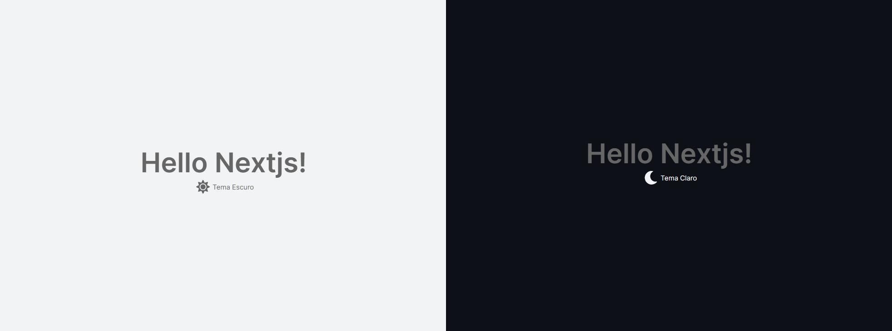

<p  align="center">

<a  href="#-project">Projeto</a>&nbsp;&nbsp;&nbsp;|&nbsp;&nbsp;&nbsp;

<a  href="#-techs">Tecnologias</a>&nbsp;&nbsp;&nbsp;|&nbsp;&nbsp;&nbsp;

<a  href="#-start">Código</a>&nbsp;&nbsp;&nbsp;|&nbsp;&nbsp;&nbsp;

<a  href="#-build">Build</a>

<a  href="#-license">License</a>

</p>

<br>

  
 <h2 align="center">
  
</h2>

## 💻 Projeto

  
Este projeto é uma aplicação NextJS com typescript implementando context API utilizando exemplo de aplicação de dark mode, para entendermos e praticarmos o uso do contextAPI
  
  

## 🧪 Tecnologias

  

O projeto foi desenvolvido usando as seguintes tecnologias:

  
- [Next.js](https://nextjs.org/)

- [React](https://reactjs.org)

- [TypeScript](https://www.typescriptlang.org/)

- [CSS Modules](https://github.com/css-modules/css-modules)

  

## 🚀 Código

  
Primeiramente em uma pasta que desejar crie um projeto nextjs

```bash
npx create-next-app meuprojeto
# or
yarn create next-app meuprojeto
```

Instale as seguintes dependências

```bash
yarn add typescript js-cookie clsx @fortawesome/fontawesome-svg-core @fortawesome/free-solid-svg-icons @fortawesome/react-fontawesome 
yarn add --dev @types/react @types/node
```

Crie um arquivo **tsconfig.json** na raiz do projeto, verifique o conteúdo neste próprio repo com as configurações. Com isso nosso projeto estará rodando com typescript sendo assim lembrar das tipagens e utilizar arquivos com extensão .ts e .tsx.

Crie uma pasta na raiz do projeto chamada **src** e dentro dela moveremos as pastas **pages** **styles**, e dentro da **src** vamos criar a seguinte estrutura que posteriormente criaremos mais arquivos.
  
```bash
-src
  --components
  --contexts
  --pages
    ---_app.tsx
    ---_document.tsx
    ---index.tsx
  --styles
    ---components
    ---pages
      ---Home.module.css
    ---global.css
```

Os arquivos e pastas ficará conforme acima, verifique neste repo e veja se está tudo de acordo ate o momento, o arquivo index.tsx na pasta pages foi alterada e demos uma limpada deixando somente o básico para este tutorial.
*Verifique seu arquivo **src/styles/global.css** pois alteramos ele com umas propriedades css diferentes e variáveis setadas.*

Observe também que na pasta **pages** criamos um arquivo chamado **_document.tsx** este serve para predefinirmos algumas coisas do no head do index.html como importação de fontes, icones, favicon, description, SEO configs etc.

Agora se rodarmos o comando abaixo nosso projeto deve funcionar normalmente para iniciarmos.

```bash
$ yarn dev
```
Retornando ao desenvolvimento, vamos criar na pasta **contexts** um arquivo chamado **ThemeContext.tsx** este sera nosso contexto para o theme dark e light, sera um provider aplicado posteriormente no arquivo **_app.tsx**.
  
```js
import React from  'react';
import Cookies from  'js-cookie';
  
interface  ThemeContextData {
theme:  'light-mode'  |  'dark-mode';
checked:  boolean;
toggleTheme: () =>  void;
}
 
interface  ThemeProviderProps {
children:  React.ReactNode;
theme:  'light-mode'  |  'dark-mode';
checked:  boolean;
}

export  const  ThemeContext  =  React.createContext({} as  ThemeContextData)

export  function  ThemeProvider({ children, ...rest }:  ThemeProviderProps) {
const [theme, setTheme] =  React.useState(rest.theme  ??  'light-mode')
const [checked, setChecked] =  React.useState(rest.checked  ??  true);

React.useEffect(() => {
Cookies.set('theme', String(theme))
Cookies.set('checked', String(checked))
}, [theme, checked])

const toggleTheme = () => {
setTheme(theme  ===  'light-mode'  ?  'dark-mode'  :  'light-mode')
setChecked(!checked)
}
  
return (
<ThemeContext.Provider  value={{ theme, toggleTheme, checked }}>
{children}
</ThemeContext.Provider>
)
}
```
Nesse arquivo podemos observar:  
- Temos a utilização do **js-cookie** para armazenar os dados digamos assim de forma que fique salvo quando dermos um refresh por exemplo;
- Temos interface criar para o contexto e para o provider em si, este e as tipagens que os respectivos necessitam, como falamos necessário no typescript;
- Criação de uma constante **ThemeContext** utilizando o **React.createContext**;
- Criação de uma função **ThemeProvider** precedida de um export para conseguimos importa-la, esta recebe como parâmetro **children** **...rest**, children e os filhos que estarão encapsulados pelo provider, e rest como prórpio nome sugere o restante das propriedade que serão utilizadas como podemos observar na respectiva interface criada para ela, e nesta função temos também;
	- React.useState para controlar localmente os estados do theme e do checked;
	- React.useEffect nos states theme e checked para replicar esses dados ao cookie; 
	- Uma função toggle que chamaremos dentro de nossa aplicação em qualquer parte para mudar o tema
	- No return retornaremos nosso componente, colocando o provider e dentro o children **{{children}}** é aonde entrará o que for encapsulado la no arquivo **_app.tsx**;


No arquivo **src/pages/_app.tsx** vamos utilizar nosso provider do tema criado, e vamos encapsular nossa aplicação assim toda ela poderá utilizar e ouvir a propriedade theme (dark ou light) para aplicarmos devidamente, o arquivo ficará conforme abaixo.
```js
import { ThemeProvider } from  '../contexts/ThemeContext'
import  '../styles/globals.css'

function  App({ Component, pageProps }) {
	return (
		<ThemeProvider  theme={pageProps.theme} checked={pageProps.checked}>
		<Component {...pageProps} />
		</ThemeProvider>
	)
}
export  default  App
```

Agora no nosso arquivo **src/pages/index.tsx** vamos importar o GetServerSideProps e criar a respectiva função no final no nosso arquivo, esta função ela serve para buscar algo do lado servidor e injetar no nosso componente, neste caso vamos buscar os dados do contexto que sao theme e checked para usarmos como propriedades neste componente.
*Observe que o GetServerSideProps capta via async e pegamos as propriedades dos cookies, que usamos através do **js-cookie** que aplicamos lá no contexto nas etapas anteriores*

Vamos usar também o tema na nossa home, vamos aplicar o contexto e aplicar o css dark e light, utilizaremos **React.useContext** para criar o contexto no componente e nele passando o themeContext, assim através da cosntante theme sabemos através de validação condicional se estar dark ou light

No nosso arquivo **src/styles/pages/Home.modules.css** que está importando no **index.tsx** vamos colocar o seguinte css, setando os backgrounds das variaveis css q estão no arquivo **src/styles/global.css**

```js
.
.
.

.lightMode {
background:  var(--light-background);
}
.darkMode {
background:  var(--dark-background);
}
```
No método **Return** do arquivo **src/pages/index.tsx**, antes da div com className container, vamos criar uma div que irá envolver a aplicação, e nela colocaremos o style conforme o tema, ficando assim:
*Observe que no className temos um condicional com a constante theme para saber se é dark ou light, e assim aplicamos o css com a cor correspondente*
```js
return (
<div  className={theme  ===  'light-mode'  ?  styles.lightMode :  styles.darkMode }>
.
.
.
</div>
);

```

*O arquivo **src/pages/index.tsx**  ficará assim:*
```js
import React from  'react'
import Head from  'next/head'
import { GetServerSideProps } from  'next'
import { ThemeContext } from  '../contexts/ThemeContext'
import styles from  '../styles/pages/Home.module.css'

interface  HomeProps {
theme:  'light-mode'  |  'dark-mode';
checked:  boolean;
}

export  default  function  Home(props:  HomeProps) {
const { theme } =  React.useContext(ThemeContext)

	return (
		<div  className={ theme  ===  'light-mode'  ?  styles.lightMode :  styles.darkMode }>

	<div  className={styles.container}>
		{/* O Head é do Next para personalizarmos o titulo da aplicação na aba do navegador, podendo assim em cada pagina termos um titulo diferente */}
		<Head>
			<title>Hello Nextjs</title>
			<link  rel="icon"  href="/favicon.ico"  />
		</Head>
		  
		<main  className={styles.main}>
			<h1  className={styles.title}>Hello Nextjs!</h1>
		</main>
	</div>
	</div>
	)
}

export  const  getServerSideProps:  GetServerSideProps  =  async (ctx) => {
const { theme, checked } =  ctx.req.cookies
	return {
		props: {
		theme:  String(theme),
		checked:  checked  ===  'true',
	}
}
}
```

Agora em **src/components** vamosc criar um arquivo chamado **Button.tsx** e em **src/styles/components** um arquivo chamado **Button.module.css**
Observamos aqui algumas features utilizadas nesse componente:
- Usamos a biblioteca Fontawesome para o icone do botão;
- Utilizamos a biblioteca clsx para aplicar mais de uma className no elemento(div, p, a etc);
- Aplicamos o themeContext e alguns condicionais nos elementos para estilizar de acordo com tema setado o contextapi;
- Observe como e feito a chamada do toglleTheme para trocar de tema, no button chamamos através do onClick;
*Lembre-se de no arquivo **src/pages/index.tsx** importar e colocar no return o seu componente Button, veja no repo como ficou*

*Observe abaixo como ficou o componente do botão **src/pages/components/Button.tsx** *

```js
import React from  'react';
import { ThemeContext } from  '../contexts/ThemeContext'
import clsx from  'clsx';
import { FontAwesomeIcon } from  '@fortawesome/react-fontawesome'
import { faMoon, faSun } from  '@fortawesome/free-solid-svg-icons'
import styles from  '../styles/components/Button.module.css'
 
const  Button:  React.FC  = () => {

const { theme, toggleTheme } =  React.useContext(ThemeContext)

return (
	<div  className={styles.container}>
		<button
		className={clsx(styles.button, theme  ===  'light-mode'  ?  styles.darkMode :  styles.lightMode)}
		onClick={toggleTheme}
		>
			<FontAwesomeIcon
			className={styles.icon}
			color={theme  ===  'light-mode'  ?  styles.darkMode :  styles.lightMode}
			icon={theme  ===  "light-mode"  ?  faSun  :  faMoon}
			/>
		{theme  ===  "light-mode"  ?  'Tema Escuro'  :  'Tema Claro'}
		</button>
	</div>
);
}

export  default  Button;
```

*Observe abaixo como ficou o componente do botão **src/styles/components/Button.module.css** *
```js
.container {
	min-height:  5vh;
	display:  flex;
	flex-direction:  row;
	justify-content:  center;
	align-items:  center;
}

.icon{
	width:  2rem  !important;
	height:  2rem  !important;
	margin:  0  0.4rem  0  0.4rem;
}
 
.button{
	display:  flex;
	flex-direction:  row;
	justify-content:  center;
	align-items:  center;
	background-color:  transparent;
	width:  12rem;
	height:  2rem;
	outline:  none;
	border:  none;
}


.lightMode {
	color:  var(--light-background);
}

.darkMode {
	color:  var(--text);
}
```

Pronto, ao executarmos nosso projeto estará tudo funcionando, e se seu projeto ja estiver rodando basta conferir o funcionamento.

```bash
$ yarn dev
```


## 🚀 Build
Para realizar o build basta executar o comando abaixo que com o package do next será feito o build e assim poderá ser feito deploy na hospedagem
```bash
$ yarn build
```


## 📝 License

  

This project is licensed under the MIT License. See the [LICENSE](LICENSE.md) file for details.

  
  

---

  

<p  align="center">Made with 💜 by <a href="https://github.com/hog099" target="_blank">Hudson Oliveira</a></p>